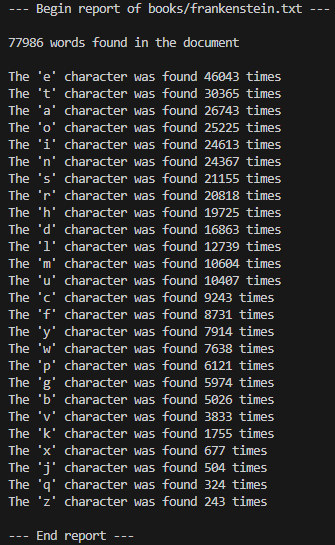

# bookbot

bookboot is a Python utility for analyzing and reporting statistics on text documents.

## Features

- Calculate word count in a document.
- Generate a character frequency report.

## Usage

**1.** Replace **```books/frankenstein.txt```** with the path to your text document.

**2.** Run **```python main.py```** inside terminal.

**3.** Result should look like this:


